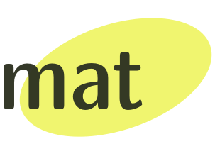

  

# Elements of Mathematics (MAT)

Welcome to the supporting website for the **Elements of Mathematics** course of the [Master in
 Bioinformatics for Health Sciences](https://www.upf.edu/web/bioinformatics). 
 
# Fall 2024-2025


<ul>
  
    <li>
      <a href="{{site.baseurl}}{{ post.url }}">{{ post.title }}</a>
    </li>
  
</ul>

# Content

Each MAT session has its own page including materials and additional content to watch/read.

To make the most out of each session, have a look at each session's content before the session takes place.

## Aim

During the sessions we will:

1. Present fundamental concepts and theoretical results
2. Solving exercises
3. Q&A
4. Do hands-on tutorials

# Evaluation

Evaluation will have two components:

<!-- 1. [Integrative work]({{ site.baseurl }}) -- at most 30% of the grade -->
1. Integrative work -- at most 30% of the grade
2. Final test -- at least 70% of the grade

# Solved tests and exercises
1. [Final test - Fall 2025]({{ site.baseurl }})
2. [Final test - Fall 2024]({{ site.baseurl }})
3. [Final test - Fall 2023]({{ site.baseurl }})
4. [Final test - Fall 2022]({{ site.baseurl }})
5. [Final test - Fall 2021 - 1st round]({{ site.baseurl }})
6. [Final test - Fall 2021 - 2nd round]({{ site.baseurl }})
7. [Mid term deliverable - Fall 2019]({{ site.baseurl }})
8. [Matrix algebra meets differential calculus]({{ site.baseurl }})

# Teacher

**Ferran Muiños** course coordinator. You can check his publications in [mathematics](https://zbmath.org/?q=au%3AFerran+Mui%C3%B1os) and [biology](https://pubmed.ncbi.nlm.nih.gov/?term=Ferran+Muin%CC%83os%5BAuthor%5D&sort=date).

# General references

**[Introduction to Linear Algebra](http://math.mit.edu/~gs/linearalgebra).**
Gilbert Strang.

**[3Blue1Brown YouTube Channel](https://www.youtube.com/c/3blue1brown).**
Grant Sanderson.

**[Steve Brunton's YouTube Channel](https://www.youtube.com/channel/UCm5mt-A4w61lknZ9lCsZtBw).**
Steve Brunton.

**Infinite Powers: How Calculus Reveals the Secrets of the Universe.**
Steven Strogatz. Houghton Mifflin Harcourt, 2019.