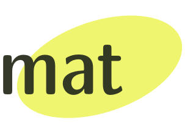

  

# Overview

Welcome to the supporting website for the **Elements of Mathematics** course of the [Master in
 Bioinformatics for Health Sciences](https://www.upf.edu/web/bioinformatics). 
 
 This course is based on remote sessions with some sessions on-site. 

# Fall 2021 sessions


<ul>
  
    <li>
      <a href="{{site.baseurl}}{{ post.url }}">{{ post.title }}</a>
    </li>
  
</ul>

Here is the [time table]({{ site.baseurl }}) for the fall 2021 term.

# Session content

Each session will be 2h covering a bunch of related topics. For the most part, the students should watch/read and digest some content before each session.

There will be sessions of two kinds: remote (online) and on-site. In the schedule above we indicate whether the sessions will be remote or on-site. In the full calendar the on-site sessions are the ones with a classroom number is indicated. On-site sessions are not planned to be recorded nor broadcast. 
 
Each session has its own page including the syllabus, the content to be watched/read before the session, links to exercises for practice and supplementary content.

## Remote sessions

We will be using the [collaborate](https://www.blackboard.com/teaching-learning/collaboration-web-conferencing/blackboard-collaborate) web conferencing platform. The remote session links will be posted in the Aula Global MAT page.

## Sessions aim

The sessions will serve several purposes:

1. Presenting the main take-homes from lecture content
2. Solve exercises
3. Q&A and discussion
4. Run tutorials

# Evaluation

Proof of work will come in three flavours:

1. Midterm homework assignment with exercises.
2. [Computational biology paper through the lens of math]({{ site.baseurl }}).
3. Final test

Tentative weighting for the score: 20% (1) + 30% (2) + 50% (3).

# Teachers

Ferran Muiños is the course coordinator. You can learn a bit more about his background by checking his publications in
 [biomedicine](https
://pubmed.ncbi.nlm.nih.gov/?term=Mui%C3%B1os+F%5BAuthor%5D&sort=date) and [math](https://zbmath.org/?q=ai%3Amuinos.ferran).

Ramon Massoni will act as invited speaker and teaching assistant for the three linear algebra tutorials. 
You can find more about his work on his [github repo](https://github.com/massonix) and on [twitter](https://twitter.com/rmassonix).

We were both students of this master back in the old days.

# References

## Specific for this course

**Introduction to Linear Algebra.**

Gilbert Strang. URL: [http://math.mit.edu/~gs/linearalgebra](http://math.mit.edu/~gs/linearalgebra)

**3Blue1Brown YouTube Channel.**

Grant Sanderson. URL: [https://www.youtube.com/c/3blue1brown](https://www.youtube.com/c/3blue1brown)

**Elementary Classical Analysis.** 

Jerrold E. Marsden, Michael J. Hoffman. W. H. Freeman, 1993.

**Infinite Powers: How Calculus Reveals the Secrets of the Universe.**

Steven Strogatz. Houghton Mifflin Harcourt, 2019.

## Off-topic

**Concrete Mathematics: A Foundation for Computer Science.**

Ronald L. Graham, Donald E. Knuth, Oren Patashnik. Addison-Wesley, 1994.

**The Art of Computer Programming (Volume 1): Fundamental Algorithms.**

Donald E. Knuth. Addison-Wesley, 1968.
