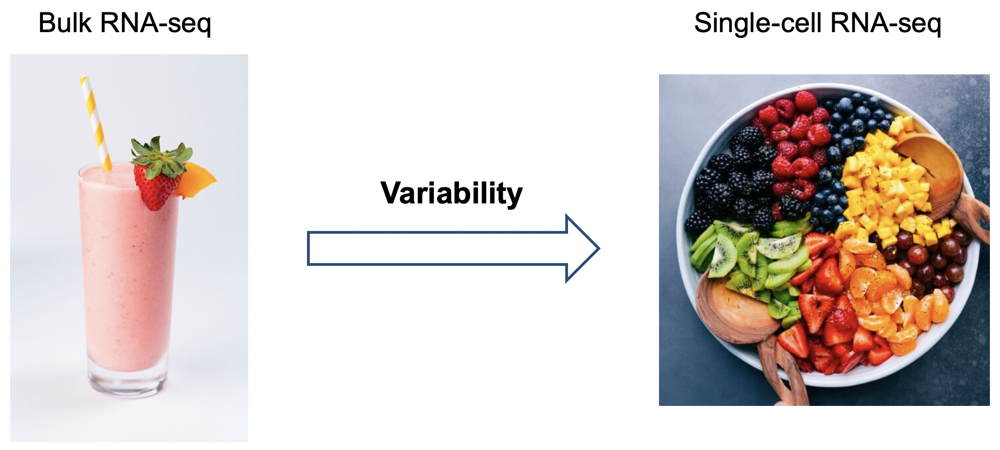
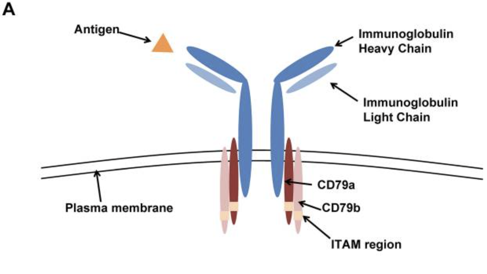

```{r setup, include=FALSE}
knitr::opts_chunk$set(echo = TRUE)
```


# Introduction and objectives

In this hands-on session, we will show how principal component analysis (PCA) is used in common bioinformatics workflows. We will use a toy [single-cell RNA-seq (scRNA-seq)](https://www.nature.com/articles/s41596-018-0073-y) dataset and a real NCI microarray data to illustrate it.

The main objectives are the following:

- Understand the intuition behind PCA.
- Learn to compute PCA in 2 ways in R: by eigendecomposition of the covariance matrix and using the `prcomp` function.
- Perform a case-study using scRNA-seq data.


# Introduction to PCA
Analyzing tabular datasets, specially high-dimensional data, involves identifying which features carry more information and whether some features can be recovered from other features. Principal component analysis (PCA) is a dimensionality reduction method that transforms high-dimensions data into lower-dimensions while retaining as much information as possible. 


We will work tabular data with numerical entries, using an $n x m$ matrix to represent feature values (columns) for experimental samples (rows).

PCA offers several advantages when analyzing biological data:

1. **Reduce the noise of the dataset**: by finding the orthogonal axis that maximize the variance, PCA eliminates noise that may have been introduced during the experiments.
2. **Reduce the redundancy**: as we will see below, when analyzing gene expression data, there is a vast degree of redundancy across gene sets. Thus, principal components can be interpreted as a "metagene": a score that summarizes information from a correlated set of genes.
3. **Reduce computational complexity**: since we reduce the dimensionality, operations downstream such as clustering will be executed faster.


# Case-study scRNA-seq data
## Introduction to scRNA-seq  
Single-cell RNA-seq allows the gene expression profiling of thousands of cells, one a time. It is often exemplified using the following analogy:



* Bulk RNA-seq would be analogous to a fruit smoothie, in which all we get is an average taste out of several fruits. Analogously, in bulk RNA-seq all we get is an average transcriptome across a population of cells.
* scRNA-seq, on the other hand, is analogous to a fruit salad, in which you can taste one fruit at a time. Here, we get a transcriptome for each single cell, so we can understand cell-to-cell variability in gene expression.

<!-- The scRNA-seq pipeline can be summarized in these 4 steps: -->

<!-- {width=90%} -->
<!-- Image extracted from [this paper](https://www.nature.com/articles/s41596-018-0073-y). -->


<!-- 1. **Sample preparation**: cells are dissociated from their original tissue into single-cells using enzymatic or mechanical treatments. -->
<!-- 2. **Single-cell RNA-sequencing**. -->
<!-- 3. **Data processing**: map the fastq reads to obtain the gene expression matrix. -->
<!-- 4. **Data analysis**, which includes clustering, differential expression analysis, gene regulatory networks, etc. -->


## Why use PCA to analyze scRNA-seq data


**scRNA-seq** is a double-edged sword. On the one hand, scRNA-seq provides **unprecedented discriminative power** to chart all the cell types and states in a given tissue. This has catalyzed the creation of [the Human Cell Atlas (HCA)](https://elifesciences.org/articles/27041), which aims to classify all cells in the human body using scRNA-seq; and has been coined as "the periodic table of human cells".


On the other hand, however, scRNA-seq has a **high degree of technical variability**, which can be introduced at multiple points of the process. Some examples include the following (Definitions extracted from table 1 of [this paper)](https://www.nature.com/articles/s41596-018-0073-y):

* **Dissociation artifacts**: enzymatic treatment is frequently used to dissociate tissues into single-cells. This can induce cellular stress that can be confounded by the variable of interest. Described in detail in [this paper](https://www.nature.com/articles/nmeth.4437?proof=t).
* **Doublets**: Two cells that are processed together in a reaction volume and receive the same single-cell barcode.
* **Dropouts**: Transcripts that are not detected in the final dataset even though the gene is expressed in the cell, leading to false zero values in the expression matrix. 


## PCA with scRNA-seq data
As an example, we will create an expression matrix with the following cells:

* 4 T-cells (identified by high expression of CD3D and CD3E).
* 3 monocytes (identified by high expression of LYZ and S100A8).
* 3 naive B-cells (identified by high expression of CD79A, CD79B and BLNK).
* 2 plasma cells (identified by B-cell and proliferation markers, such as TOP2A or MKI67).
* 2 poor-quality cells (identified by high mitochondrial expression). If a cell has pores in the membrane due to cell lysis, the cytosolic mRNA will leak out of the cell; but if the diameter of mitochondria is higher than the pores, they will get trapped inside the cell.

In the following image you can visualize the redundancy between CD79A and CD79B. Together, they form the heterodimer CD79; which means that for every molecule of CD79A we need one of CD79B. Under the hood they are the same variable, which should be captured by a single principal component. 



Image obtained from [this link](https://ashpublications.org/blood/article/120/6/1175/30492/The-B-cell-receptor-signaling-pathway-as-a)


## Create and visualize toy dataset

Load packages

```{r message=FALSE, warning=FALSE}
library(pheatmap)
library(tidyverse)
```

We will create a toy dataset that contains the gene expression of each of the cells. Cells are represented as rows and genes as columns.

```{r}
# Create toy dataset
toy <- data.frame(
  CD3D = c(4, 5, 4, 3, 0, 0, 0, 0, 0, 0, 0, 0, 0, 0),
  CD3E = c(5, 3, 4, 4, 0, 0, 0, 0, 0, 0, 0, 0, 0, 0),
  LYZ = c(0, 0, 0, 0, 5, 7, 6, 0, 0, 0, 0, 0, 0, 0),
  S100A8 = c(0, 0, 0, 0, 5, 7, 6, 0, 0, 0, 0, 0, 0, 0),
  CD79A = c(0, 0, 0, 0, 0, 0, 0, 6, 4, 4, 3, 5, 0, 0),
  CD79B = c(0, 0, 0, 0, 0, 0, 0, 5, 5, 3, 4, 6, 0, 0),
  BLNK = c(0, 0, 0, 0, 0, 0, 0, 6, 4, 5, 5, 4, 0, 0),
  TOP2A = c(0, 0, 0, 0, 0, 0, 0, 0, 0, 0, 12, 9, 0, 0),
  MKI67 = c(0, 0, 0, 0, 0, 0, 0, 0, 0, 0, 11, 10, 0, 0),
  MT_CO1 = c(0, 0, 0, 0, 0, 0, 0, 0, 0, 0, 0, 0, 18, 23),
  MT_ND5 = c(0, 0, 0, 0, 0, 0, 0, 0, 0, 0, 0, 0, 22, 25) 
)
rownames(toy) <- paste("cell", as.character(1:nrow(toy)))
toy <- as.matrix(toy)


# Visualize
pheatmap(toy, cluster_cols = FALSE, cluster_rows = FALSE, angle_col = 45)
```


## PCA in R: 2 ways

Two ways to perform PCA in R: 

* Eigendecomposition of the covariance matrix.
* `prcomp` function.

Regardless of the method, we always need to normalize the data (center and scale). We will do it by using the function [`scale`](https://www.rdocumentation.org/packages/base/versions/3.6.2/topics/scale).

The function `scale` takes as arguments the matrix and two parameters: `center` and `scale`, that can be either a logical value or a numeric-alike vector of length equal to the number of columns of the matrix. 

* `center`:  if `center` is a numeric-alike vector with length equal to the number of columns of the matrix, then the output will have the result of substracting these values to each of the values in the corresponding columns. If `center` is `TRUE` then centering is done by subtracting the column means (omitting NAs) of the matrix from their corresponding columns, and if `center` is `FALSE`, no centering is done. 
* `scale`: if `scale` is a numeric-alike vector with length equal to the number of columns of the matrix, then, after centering,  each column of the matrix is divided by the corresponding value from `scale`. If `scale` is `TRUE` then scaling is done by dividing the (centered) columns of the matrix by their standard deviations, and if `scale` is `FALSE`, no scaling is done. 


```{r}
toy_centered <- scale(toy, center = TRUE, scale = FALSE)
toy_normalized <- scale(toy, center = TRUE, scale = rep((sqrt(nrow(toy)-1)), ncol(toy)))

toy_normalized[1:5,1:5]
```

Now we will compute the exact same thing (PCA) in the 2 ways. 

In each case we will be tracking the same three pieces of information:

* the **principal components** (pdir), also known as **loadings**.
* the **variance** of the data along each **principal component** (var).
* the **scores** of each data sample in the **principal components** (score).

### Eigendecompostion of the covariance matrix

We will be computing an eigenbasis for the covariance matrix 
$\Omega = A^tA$ where $A$ is the normalized data (centered and scaled). We will use the function [`eigen`](https://www.rdocumentation.org/packages/base/versions/3.6.2/topics/eigen).

The **eigenvectors** of the covariance matrix are the **loadings** (principal components):

```{r}
cov_matrix <-  (t(toy_normalized) %*% toy_normalized)
eigen_cov_matrix <- eigen(cov_matrix)

pdir_eigen <- eigen_cov_matrix$vectors
pdir_eigen[1:5,1:5]
```


The **eigenvalues** contains the **variance** of the data along each principal component.
```{r}
var_eigen <- eigen_cov_matrix$values
head(var_eigen)
```

The **scores** of each data sample in the principal components can be obtained by multiplying the original centered matrix with the matrix with the eigenvectors as columns:
```{r}
scores_eigen <- toy_centered %*% pdir_eigen
scores_eigen[1:5, 1:5]
```


### PCA

Now we will use a stand-alone PCA function provided by R, [`prcomp`](https://www.rdocumentation.org/packages/stats/versions/3.6.2/topics/prcomp), to calculate the principal components. 

For the `prcomp` function we don't need to scale the data, it is already implemented within the function. We do need to center the data. 

```{r}
pca_out <- prcomp(toy, center = TRUE, scale = FALSE)
```

We can use the following keywords to parse the output instance:

Principal components (**loadings**): **"rotation"**


```{r}
pdir_pca <- pca_out$rotation
pdir_pca[1:5,1:5]
```

**Standard deviations** : **"sdev"**

(We need to multiply by $n-1$ since, in `prcomp`, variances are computed with the usual divisor $n-1$. See [documentation](https://www.rdocumentation.org/packages/stats/versions/3.6.2/topics/prcomp).)
```{r}
var_pca <- (pca_out$sdev)** 2 

head(var_pca)
```

Principal components **scores**: **"x"**

```{r}
scores_pca <- pca_out$x
scores_pca[1:5,1:5]
```


In summary, we obtain the following:

* Gene loadings: `pca_out$rotation`
* Variance associated to each principal component: `pca_out$sdev ** 2`
* PC scores: `pca_out$x`


## Infer dimensionality of the dataset

<!-- **Note:** -->

<!-- For the posterior analyses we will use: -->
<!-- ```{r} -->
<!-- pca_out <- prcomp(toy, center = TRUE, scale = TRUE) -->
<!-- ``` -->


When using `prcomp` function can get the **proportion of variance explained (PVE)** and the **cumulative proportion** with the `summary` function (more info in [this book](https://faculty.marshall.usc.edu/gareth-james/ISL/ISLR%20Seventh%20Printing.pdf)):

```{r}
summary(pca_out)
```

To reduce the dimensionality, we will choose the number of PC that explains most of the variance in the dataset. To this end, we use a so-called elbow plot:


```{r}
# Calculate percentage of variance explained (PVE):
pve <- pca_out$sdev ** 2 / sum(pca_out$sdev ** 2) * 100
pve <- round(pve, 2)
pve_df <- data.frame(principal_component = 1:length(pve), pve = pve)
pve_gg <- pve_df %>%
  ggplot(aes(principal_component, pve)) +
    geom_point() +
    geom_vline(xintercept = 4.5, linetype = "dashed", color = "darkblue") +
    scale_x_continuous(breaks = 1:length(pve)) +
    labs(x = "Principal Component", y = "Percentage of Variance Explained (%)") +
    theme_bw()
pve_gg
```

Some people prefer to plot the cumulative proportion of explained variance:

```{r}
summ_pca <- summary(pca_out)
cum_pct <- summ_pca$importance["Cumulative Proportion", ] * 100
cum_pct_df <- data.frame(principal_component = 1:length(pve), cum_pct = cum_pct)
cum_pct_gg <- cum_pct_df %>%
  ggplot(aes(principal_component, cum_pct)) +
    geom_point() +
    geom_vline(xintercept = 4.5, linetype = "dashed", color = "darkblue") +
    scale_x_continuous(breaks = 1:length(cum_pct)) +
    scale_y_continuous(limits = c(0, 100)) +
    labs(x = "Principal Component", y = "Cumulative Percentage of Variance Explained (%)") +
    theme_bw()
cum_pct_gg
```


Thus, we conclude that the first 4 PC are significant. Let us express each cell as a vector of the first 4 PC (scores):

```{r}
toy_reduced <- pca_out$x[, c("PC1", "PC2", "PC3", "PC4")]
pheatmap(toy_reduced, cluster_rows = FALSE, cluster_cols = FALSE, angle_col = 45)
```


## Visualize gene loadings

Now we have reduced the dimensionality of the dataset. To interpret each principal component, let us inspect the gene loadings:

```{r}
gene_loads_reduced <- pca_out$rotation[, c("PC1", "PC2", "PC3", "PC4")]
significant_pcs <- c("PC1", "PC2", "PC3", "PC4")
loadings_gg <- map(significant_pcs, function(x) {
  loadings <- gene_loads_reduced[, x]
  df <- data.frame(gene = names(loadings), score = loadings)
  p <- df %>%
    ggplot(aes(fct_reorder(gene, score), score)) +
      geom_point() +
      labs(x = "", y = x) +
      theme_bw() +
      coord_flip()
  return(p)
})
loadings_gg
```

<!-- Interpretation of the PC: -->

<!-- * PC1: B cell identity. -->
<!-- * PC2: differences between monocytes and T cells. -->
<!-- * PC3: technical variation. -->
<!-- * PC4: cell cycle. -->


## Cluster cells

Clustering means classifying observations into groups that minimize and maximize intra-group and inter-group distances, respectively.


### Calculate all pairwise Euclidean distances

To that end we need a concept of distance, which basically measures how similar or different two vectors are. In our case we will use Euclidean distance, but be aware that there are a plethora of different options that can yield different clustering results.

Let us start by computing all pairwise distances (distance between cells, considering their expression profiles):

```{r}
dist_mat <- dist(toy_reduced, method = "euclidean")
pheatmap(dist_mat, cluster_rows = FALSE, cluster_cols = FALSE)
```


## Perform hierarchical clustering

```{r}
hclust_average <- hclust(dist_mat, method = "average")
plot(
  hclust_average,
  labels = rownames(toy),
  main = "Average Linkage",
  xlab = "",
  sub = "",
  ylab = "Cophenetic distance"
)
```


### Cut the dendrogram and visualize clusters

```{r}
plot(
  hclust_average,
  labels = rownames(toy),
  main = "Average Linkage",
  xlab = "",
  sub = "",
  ylab = "Cophenetic distance"
)
abline(h = 7.5, col = "red")


```

Visualize the correspondent cluster to each of the cells:
```{r}
hc_clusters <- cutree(hclust_average, h = 7.5)
hc_clusters
```

Visualize the number of cells in each cluster:
```{r}
table(hc_clusters)
```


### Annotation

| Cluster | Cell type          |
|---------|--------------------|
| 1       | T-cells            |
| 2       | Monocytes          |
| 3       | Naive B-cells      |
| 4       | Plasma Cells       |
| 5       | poor-quality cells |


Visualize the centered gene expression across cells and their corresponding cluster:

```{r}
annotation_rows <- data.frame(cluster = as.character(hc_clusters))
rownames(annotation_rows) <- names(hc_clusters)
annotated_clusters <- c("T-cells", "Monocytes", "Naive B-cells", "Plasma Cells", "poor-quality cells")
names(annotated_clusters) <- as.character(1:5)
annotation_rows$annotation <- annotated_clusters[annotation_rows$cluster]
pheatmap(
  toy_normalized,
  cluster_rows = FALSE,
  cluster_cols = FALSE,
  angle_col = 315,
  annotation_row = annotation_rows
)
```


# Exercise microarray data

We will use the data from [NCI 60](https://rdrr.io/cran/ISLR/man/NCI60.html) Data from the [ISLR package](https://cran.r-project.org/web/packages/ISLR/index.html). This data set contains NCI microarray data. The data contains expression levels on 6830 genes from 64 cancer cell lines.

**Exercise**

Find the principal components of this dataset and cluster the cell lines according to their similarities in gene expression. 

We will load the data and keep the information of the table and the tumor types of the cell lines:


```{r message=FALSE, warning=FALSE}
library(ISLR)
data_NCI60 <- NCI60$data
labels_NCI60 <- NCI60$labs
rownames(data_NCI60) <- labels_NCI60

```

We can look at the dimension of the data set which contains information about 64 cell lines of different tumor types and 6830 genes. 

```{r message=FALSE, warning=FALSE}
dim(data_NCI60)
```

We can see the list of the tumor types:

```{r message=FALSE, warning=FALSE}
labels_NCI60
```

**Solution** 

We will use the function `prcomp` to calculate the principal components. 


## Perform PCA

```{r message=FALSE, warning=FALSE}
pr_output <- prcomp(data_NCI60, center = TRUE)
```

As in the previous example, we can calculate the **loadings**:
```{r message=FALSE, warning=FALSE}
pdir_pca <- pr_output$rotation
pdir_pca[1:6,1:6]
```

The **standard deviations** :


```{r message=FALSE, warning=FALSE}
var_pca <- pr_output$sdev ** 2
head(var_pca)
```

And the principal components **scores**
```{r message=FALSE, warning=FALSE}
scores_pca <- pr_output$x
scores_pca[1:6,1:6]
```

## Plot the scores 
We will plot the first 2 principal components score vectors with a dot plot, in order to visualize the data. We will color the observations (cell lines) according to their cancer type. In this way we can see to what extent the observations within a cancer type are similar to each other. 

```{r message=FALSE, warning=FALSE}
scores <- as.data.frame.array(pr_output$x)
scores$tumor_type <- labels_NCI60
scores %>% 
  ggplot(aes(x = PC1, y = PC2, color = labels_NCI60)) +
    geom_point() +
    labs(x = "PC1", y = "PC2") +
    theme_classic()
```


## Visualize proportion of the variance explained
```{r message=FALSE, warning=FALSE}
summary(pr_output)$importance[,c(1:14)]
```

As in the previous example we will represent the cumulative proportion of variance explained:
```{r message=FALSE, warning=FALSE}
pve <- pr_output$sdev ** 2 / sum(pr_output$sdev ** 2) * 100
pve <- round(pve, 2)
pve_df <- data.frame(principal_component = 1:length(pve), pve = pve)
summ_pca <- summary(pr_output)
cum_pct <- summ_pca$importance["Cumulative Proportion", ] * 100
cum_pct_df <- data.frame(principal_component = 1:length(pve), cum_pct = cum_pct)
cum_pct_gg <- cum_pct_df %>%
  ggplot(aes(principal_component, cum_pct)) +
    geom_point() +
    scale_x_continuous(breaks = 1:length(cum_pct)) +
    scale_y_continuous(limits = c(0, 100)) +
    labs(x = "Principal Component", y = "Cumulative Percentage of Variance Explained (%)") +
    theme_bw()
cum_pct_gg

```


## Cluster the samples

In this case, we will select the first 8 PC.
We can cluster the samples within the heatmap:
```{r message=FALSE, warning=FALSE}
pheatmap(scores[, c("PC1", "PC2", "PC3","PC4","PC5", "PC6", "PC7","PC8")], cluster_rows = TRUE, cluster_cols = FALSE, angle_col = 45, labels_row = labels_NCI60, fontsize_row = 5)

```


# Session Information

```{r}
sessionInfo()
```

